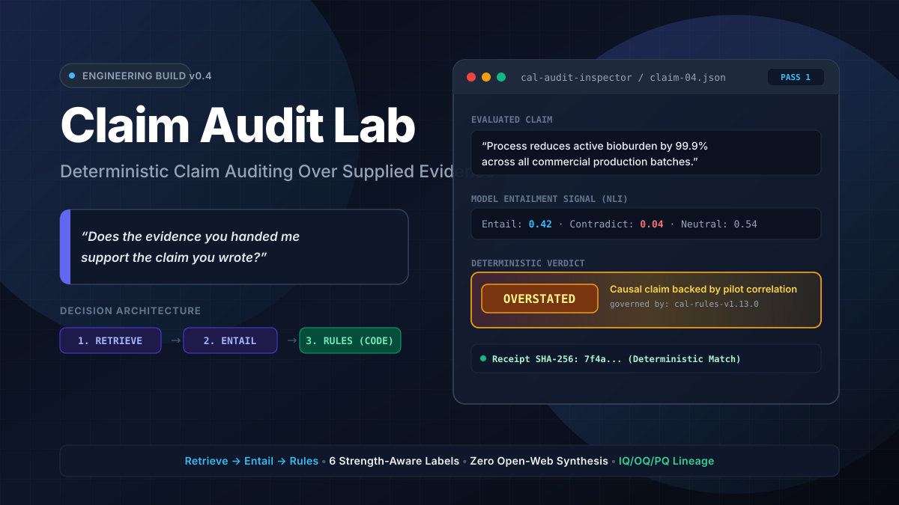

# Claim Audit Lab



[](#verification)
[](#verification)
[](pyproject.toml)
[](LICENSE)
[](#status)

**Audit whether draft claims are actually carried by the evidence supplied with them.**

Claim Audit Lab retrieves candidate passages, asks an NLI model whether they entail the
claim, and then decides under a frozen, versioned rule set. A language model contributes a
signal; deterministic code makes the decision. Deterministic bundle/report paths reproduce
byte-for-byte when their run metadata is pinned; real inference uses a canonical decision
receipt so tiny supported-platform score differences do not change the regression contract.

It does not search the open web, and it does not decide whether a statement is true of the
world. It answers a narrower question: **does the evidence you handed me support the claim
you wrote?**

📖 **Documentation:** start with the repository-local [overview](docs/index.html),
[architecture](docs/architecture.html), [research briefs](docs/research.html), and
[benchmarks & limits](docs/benchmarks.html). GitHub Pages is not enabled for this repository.

---

## Status

**Engineering build. Mechanisms verified, accuracy not validated.**

| | |
|---|---|
| Distribution | `0.5.0`; adds the public Contract C 1.0.0 exporter. `0.4.0` remains the first public tag |
| Default engine | `v1-retrieve-entail`, retrieve → entail → rules on `audit` and `demo` |
| Selectable | `v0.2-lexical` via `--engine` (falsified; kept for apparatus pins) |
| Frozen rules | `cal-rules-v1.13.0`, governs the v1 engine only |
| Blind acceptance gate | Exploratory 2026-07-24 on `cal-rules-v1.7.0`, n=50 vs **human** gold. Re-scored 2026-08-20: exact **27/50**, AC2 0.7901, weighted κ 0.6876. Unchanged. Not a confirmatory packet. |
| Constructed twin | Same 25+25 shape, **derived** keys: **47/50** on `cal-rules-v1.11.0`. Not a recode of the sealed 50. |
| Release tag | `v0.5.0`. **Not** `v1.0.0`. The leading zero is still the claim being made about the interface and the accuracy story alike. |
| Known limits | **D15**, a rules-only replay cannot test a gate whose inputs postdate its baseline; it reported `A5` as a no-op on human gold when the gate in fact moves 2 of 98. PILOT-001 exact agreement is **62/98**, corrected from 64/98. Numeric bounds (D1/D4/D12) and two-hop composition are v2 operators: CAL asks, it does not invent the comparison or the join. D6 held; D7 must not land alone. A7 withholds a contradiction when the passage names a different site than the claim. |

The v0.2 lexical matcher was falsified as a measurement instrument by a blind PILOT-001
calibration on 2026-06-18 (4/98 exact agreement, Cohen's κ ≈ −0.006). v1 is the redesign of
the inference core in response.

**Intended use (Track A):** an independent first-pass auditor. Verdicts are review
inputs. A human still disposes consequential claims. Human gold is measurement, not
permission to run.

The July 50-item **human**-gold figure is 27/50 (on-scale AC2 0.7901 over n=22, not 50).
That is what CAL vs one coder looks like on messy extracted claims. It is not a
`v1.0.0` authorization. Against derived keys on licensed paraphrases of stipulated
worlds, the same engine is 47/50. The remaining misses are numeric bounds, a quantity
demotion, and (before A7) a site-scope false adverse.

Four qualifications travel with any public number:

1. **AC2 / weighted κ are computed over the on-scale minority, not 50.** `not_checkable`
   sits off the ordinal scale. Exact 27/50 is the only headline on the whole human set.
2. The human-gold gate ran on `cal-rules-v1.7.0`; the shipped tree is now `v1.13.0`.
3. D6 is held. D7 must not land without D6. Numeric comparison is a different operator
   family, deferred.
4. Exact agreement at 54% against a person is not a solved problem. Abstention with a
   specific question is the designed remaining behavior.

Nothing in this repository is validation evidence, gate clearance, an accuracy claim, or a
GxP capability claim. Published measurements are DEV-grade and carry their population and n.
See [Benchmarks & limits](docs/benchmarks.html) for the open defect register, including the
ones that are embarrassing.

---

## Install

Not yet published to PyPI. Install the released `0.5.0` source from a checkout, from the
GitHub Release artifacts, or directly from GitHub. The v1 engine remains the ordinary released
`audit` and `demo` path; 0.5.0 adds Contract-C export without changing verdict semantics.

```bash
# released source from GitHub; base is pure Python
python -m pip install "claim-audit-lab @ git+https://github.com/camerontjs-dot/claim-audit-lab"

# with the v1 retrieve -> entail engine (CPU-only by design)
python -m pip install "claim-audit-lab[v1] @ git+https://github.com/camerontjs-dot/claim-audit-lab"
python -m spacy download en_core_web_sm
```

## Three version strings, and what each one means

They are not interchangeable, and two of them used to collide.

| axis | value | identifies |
|---|---|---|
| distribution | `0.4.0` | the Python package |
| **engine** | `v1-retrieve-entail` (ordinary `audit`/`demo`) or `v0.2-lexical` | **which pipeline actually audits** |
| rules version | `cal-rules-v1.13.0` | the frozen decision layer inside the v1 engine, SHA-pinned |

Package `0.2.0` and engine `v0.2-lexical` shared a number by accident, which read as
though the whole package were the retired lexical matcher. The bump broke that collision.
`0.3.0` was declared but never released and named several different trees while the v1 work
was in flight, so the first public tag is `0.4.0`, one version string, one tree.
Engine and rules version both travel inside every v1 trace, so a trace always says which
code produced it.

## Which command runs which engine

**This is the thing to know before running anything.** Ordinary `audit` and `demo`
run retrieve → entail → rules. The `v0.2-lexical` engine is the falsified one (4/98 exact
agreement, Cohen's κ ≈ 0 on PILOT-001) and remains selectable.

| command | engine | notes |
|---|---|---|
| `claim-audit demo` | `v1-retrieve-entail` | fixture demo; `--engine v0.2-lexical` for the retired matcher |
| `claim-audit audit` | `v1-retrieve-entail` | ordinary draft + YAML evidence; `--engine v0.2-lexical` still works |
| `claim-audit audit-bundle` | `v0.2-lexical` **by default** | runs v1 only when the bundle's `CBAuditConfig.pipeline` is `v1-retrieve-entail` |
| `claim-audit calibrate` | `v1-retrieve-entail` | research harness: needs a packet, a gold file and a config |
| `claim-audit explain` | none | read-only over traces v1 already wrote |

`audit-bundle` stays pin-faithful: sealed C-B bundles that do not opt in keep the
lexical path so apparatus consumers are not silently re-routed.

## Quickstart

Run the built-in fixture demo. Requires the `[v1]` extra (CPU DeBERTa stack).
No API keys.

```bash
claim-audit demo --out-dir ./demo-out
```

Audit a draft against an evidence bundle (same v1 engine):

```bash
claim-audit audit DRAFT.md --evidence evidence.yml --out ./report.md --json-out ./report.json
```

Audit a locked C-B evidence bundle, writing a resealed copy without mutating the input:

```bash
claim-audit audit-bundle ./evidence-bundle --out-dir ./out
```

### The human-readable report

`demo` writes one automatically; `audit` writes one on request:

```bash
claim-audit audit DRAFT.md --evidence evidence.yml --out ./report.md --html-out ./report.html
```

The HTML report is a **single self-contained file**: the stylesheet is inlined, there are
no scripts, and nothing is fetched when it is opened. It renders offline, it is safe to
email, and it looks the same in a year. Rendering is deterministic: nothing in it reads the
clock, so the same audit produces the same bytes.

Every report states what produced it: engine, rules version, `rules_file_sha`,
`audit_config_hash`, library version. It also carries a status band saying what it is not.
That band is not decoration. This is the surface most likely to be forwarded to someone who
never opens this README.

**For PDF, print it from a browser.** The stylesheet has a print block that forces a light
sheet, sets page margins, keeps a claim from splitting across a page break, and expands link
targets. That is deliberately not a generated PDF: a PDF writer stamps a creation date and a
file ID into every run, so a generated PDF could not be byte-reproducible even though the
audit behind it is. The HTML is the record; the print is a rendering of it.

On `audit-bundle` the report is opt-in, because there the audited bundle is the artifact and
apparatus consumers read the traces:

```bash
claim-audit audit-bundle ./evidence-bundle --out-dir ./out --html-report
```

Explain what CAL decided and, when it abstained, why, read-only over traces it already
wrote. Runs no model and re-decides nothing:

```bash
claim-audit explain ./out/traces --out-dir ./explanations
```

```
Explained 98 traces
Verdicts:
    65  supported
    26  not_checkable
     4  partially_supported
     2  contradicted
     1  unsupported
Abstentions: 26/98 (26.5%)
    12  refutation_stood_down
     7  read_silent
     3  ambiguous_support
     2  conflicting_signal
     2  no_evidence_admitted
```

Every abstention carries a named reason and a reviewer next step, so `not_checkable` stops
being one undifferentiated bucket. See
[Benchmarks](docs/benchmarks.html) for what
those reasons look like across two corpora.

Programmatic use:

```python
from claim_audit_lab import audit_claims
from claim_audit_lab.v1 import load_default_audit_config

config = load_default_audit_config()   # pinned, SHA-verified thresholds
report = audit_claims(claims, evidence)
```

## How it works

Three layers, each answering a different question. They fail on
[disjoint populations](docs/research/brief-01-chunk-granularity-disjointness.md), so neither
fix substitutes for the other.

| | Layer | Kind | Decides | Key parameters |
|---|---|---|---|---|
| 1 | **Retrieve** | bi-encoder, probabilistic | which evidence is in the room | `retrieval_floor` 0.40, `top_k` 5 |
| 2 | **Entail** | DeBERTa-v3 NLI, probabilistic | whether a passage entails the claim | `supported_threshold` 0.70, `contradicted_threshold` 0.70 |
| 3 | **Rules** | frozen, deterministic | **the verdict** | `cal-rules-v1.13.0`, SHA-pinned |

Rule families `A1–A4` (gating and adverse), `B5` (degree), `C6a–f` (overreach), `P1–P2`
(eligibility). Every rule that fires is recorded by id in the trace, alongside
`audit_config_hash` and `library_version`.

Full detail: [Architecture](docs/architecture.html).

## Research

CAL is developed as an instrument, so its own behaviour is measured. Each probe writes a
dated directory with its script, raw results, per-claim traces, and a `SHA256SUMS` manifest.
Raw result files are never edited; corrections are appended as amendments.

**[Brief 01: Why context allocation and semantic entailment fail on disjoint populations](docs/research/brief-01-chunk-granularity-disjointness.md)**

Changing only the retrieval passage unit (sections to clauses) rescued **2 of 2**
retrieval-floor failures and **0 of 10** entailment failures. A supporting clause that scores
**0.392** inside its section scores **0.924** as its own unit: same text, same claim, same
encoder. Because a claim that never clears the floor is never scored by the entailer, the two
populations are disjoint by construction, and the size of each problem is unchanged by fixing
the other.

The repository-local [overview](docs/index.html) can replay all twelve cases from the sealed
traces.

**[Brief 02: A gold that derives its own answers, and the coupled defect it found](docs/research/brief-02-construction-gold.md)**

CAL's only human-labelled reference is measurably unreliable on absence claims: the coded
verdict tracked how much material was in the bundle rather than any stated rule (Fisher exact
**p = 0.0008**). So the reference was rebuilt as 33 cases whose verdicts are *derived from how
each case was constructed*, regenerable rather than trusted, and no rater to disagree with.

CAL scored **14 of 33** on a corpus deliberately concentrated on suspected failure shapes.
Seven cases are constructed contradictions; the entailer caught all seven at 0.975–0.996 and
`A4_negation_consistency` stood down all seven. The three `contradicted` verdicts CAL did emit
were all on sources verified silent. And adding one passage stating the same obligation *for a
different site* flipped a correct `supported` to an abstention. `max_entailment` takes the
highest score regardless of its label.

Both defects landed together as `cal-rules-v1.10.0`, because the corpus showed they could not
land separately: replaying the real trace with the new gate blinded, the A4 fix on its own
produces a **false `contradicted` on a correctly-sourced claim**. After the fix, exact
agreement is **20 of 33**, the `contradicts` relation is **6/6**, and the adverse verdict goes
from precision 0/3 and recall 0/7 to **6/9 and 6/7**. Six verdicts moved, all wrong→right, and
**0 of 30** frozen inference goldens flip.

**This landing is not free on human gold, and the correction is worth reading.** It was
published as a no-op: 0 of 98 PILOT-001 verdicts changed against a rules-only control
replay. Run end to end on 2026-08-20 it moves **2 of 98**, both `supported` →
`not_checkable` via `A5_conflicting_evidence`, and human gold says `supported` for both.
Exact agreement on PILOT-001 is **62/98**, not the 64/98 inherited from `v1.7.0`.

The replay could not have seen it. `A5` reads `best_entail` and `best_contradict` on the
support signal, and **those fields did not exist when the replayed baseline was recorded**,
so the gate's precondition was unsatisfiable by construction. The evidence itself is
identical. Same passages, same labels, 0 of 98 claims differ in entailed-set size. A
rules-only replay cannot test a gate whose inputs postdate its baseline (D15).

A third defect (an adverse verdict on absence claims whose source is silent) landed as
`cal-rules-v1.10.0`, taking the corpus to **22 of 33** and the adverse verdict to
**precision 6/6**. No false adverse verdict remains on it, at unchanged recall. The
obvious fix there was lexical, and it separated the cases perfectly; it was rejected and
rebuilt as a claim-side structural feature, because *overlap may flag, never decide* is a
standing invariant here, adopted after the v0.2 lexical matcher was falsified, and after
the same error was re-imported one layer up once already.

`cal-rules-v1.11.0` then taught A6 to read the declared `source_boundary`, which moved the
three exhaustive absences and the named-gap case. Re-run on the shipped `cal-rules-v1.13.0`,
the corpus stands at **26 of 33**, with the adverse verdict at **precision 7/7 and recall
7/7** and variant-group partition agreement **7 of 9**. Neither `v1.11.0` nor `v1.12.0`
moves a human-gold verdict, checked end to end, not by replay.

**All seven remaining misses are false abstentions**. Every one is gold `supported`, CAL
`not_checkable`. There is no false adverse verdict left anywhere in the corpus at this rules
version. That was a statement about the corpus and not the engine until `v1.13.0`: **D14**
was a false adverse verdict found outside the corpus, measured at **14 of 66** identifier×verb
combinations and now down to **3 of 66**. Every A7 passage in the corpus is short and free of
alphanumeric identifiers, which is why the corpus never caught it. That is the designed direction to fail in, and it is still failing: CG-05 is D12
(the entailer cannot instantiate a numeric bound), CG-06/CG-14/CG-15 are composition that v1
never forms across passages, and CG-23b is two passages disagreeing where A5 abstains and
asks which site the claim is about. Four of the 26 agreements are also reached with zero
passages entailed (right answer, no reasoning) and are counted and named rather than
quietly banked.

## Run, architecture, limits, and research

Run `claim-audit demo --out-dir ./demo-out` after installing the `[v1]` extra. It writes
Markdown, JSON, and a self-contained HTML report. The [architecture](docs/architecture.html)
explains the retrieve → entail → rules separation; [benchmarks & limits](docs/benchmarks.html)
records known failures; [research](docs/research.html) contains DEV-grade measurements and is
not a validation claim. CAL audits supplied evidence only: it is not a truth engine, validated
software, or a GxP capability.

Expected demo output includes an `ai-research-note.cli.md` report naming
`v1-retrieve-entail` and `cal-rules-v1.13.0`.

## Verification

The default public suite is self-contained and runs from a fresh clone. It excludes only the
named research-artifact tests, whose ignored CAL outputs and sibling-project inputs are not
part of this distribution. Run those locally, with their artifacts present, using
`python -m pytest -m research_artifact`.

```bash
python -m pip install -e ".[dev,v1]"
python -m spacy download en_core_web_sm
python -m pytest -q
python -m coverage run --branch -m pytest -q
python -m coverage report --include="src/*"
python -m mypy
python -m ruff check src/ && python -m ruff format --check src/
```

The install verifier is separate: it builds a local wheel, creates three clean virtualenvs,
and installs that wheel. It provisions the spaCy pipeline from the local environment when one
is already installed, and otherwise falls back to `spacy download`:

```bash
python scripts/verify_install.py
```

Public-release verification, 2026-08-21, Python 3.11.15:

| Check | Result |
|---|---|
| Public `pytest` suite | **957 passed, 5 skipped** (48 local research-artifact tests deselected) |
| Branch coverage, `src/` | **95%** (4073 stmts, 1192 branches) |
| Clean-wheel install, v0.2 + v1 + ui surfaces | **verified** |
| Sealed research outputs | historical local receipt: **39/40 verify**. One is intentionally failing; see [DEV-005](validation/deviation-log.md) |
| `mypy --strict` | **0 errors**, 49 source files |
| `ruff check` + `format --check` | **0 errors**, `src/` fully formatted |

The real-inference golden tests assert an exact raw trace on repeated runs in one locked
environment, then compare a cross-host portable decision receipt. That receipt preserves the
pinned model/rule provenance, features, retrieval ranking, NLI labels, support-signal passage
identities, fired rule IDs, and verdict. Raw model scores are retained and required to be
finite, but are not claimed to be byte-identical across supported CPU environments. These
receipts describe current `main`, a post-`v0.4.0` public-polish snapshot; the immutable
`v0.4.0` tag remains at its original release commit.

Installing the UI surface additionally requires the `[ui]` extra, which pulls `fastapi`,
`uvicorn`, and the `[v1]` inference stack:

```bash
python -m pip install "claim-audit-lab[ui] @ git+https://github.com/camerontjs-dot/claim-audit-lab"
```

## Documentation

The site under [`docs/`](docs/) is static HTML/CSS/JS with no build step or runtime
dependencies. GitHub Pages is currently disabled, so use these repository-relative files.

| Page | |
|---|---|
| [Overview](docs/index.html) | what it is, the three layers, install, sealed-trace replay |
| [Architecture](docs/architecture.html) | why the verdict cannot come from the model |
| [Research](docs/research.html) | briefs, and the hypotheses that died |
| [Benchmarks](docs/benchmarks.html) | receipts, failure taxonomy, open defect register |

Figures on the site are generated from the sealed probe directories by
`scripts/gen_docs_traces.py` rather than transcribed, so the site and the briefs cannot drift
apart without the generator failing.

## Repository layout

```
src/claim_audit_lab/       library + CLI
  v1/                      retrieve -> entail -> rules core
    configs/               frozen, SHA-pinned rule sets
  assets/                  report stylesheet, inlined into rendered HTML reports
  ui/                      Visual Workbench UI, stdlib server + FastAPI app
tests/                    957-test public suite plus explicitly marked local research-artifact tests
docs/                      static documentation site
scripts/                   verification and generation utilities
schema/                    contract version + vocabulary
```

## License

MIT. See [LICENSE](LICENSE).
